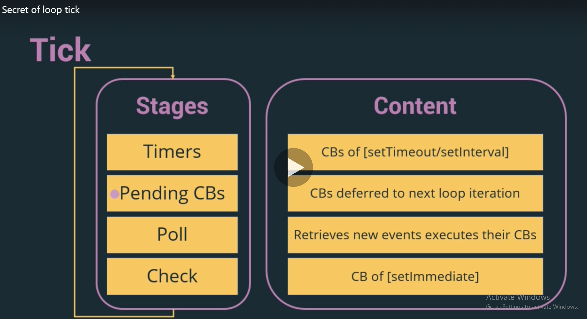

#### Learn NodeJS in 6 hours only 2021
Learn the Basics of Node.js, asynchronous JavaScript, Express, API Development, MongoDB Driver, Sending Emails and more.

# Section 2 - NodeJS Basics

#### NodeJS Dependencies

**Libraries**
1. A JAvascript Engine (V8 Engine) - Written in C++
2. An asynchronous code handler (Libuv - Written in C) - A library that implements Node.JS event loop and all of the asynchronous behaviours of the platform.

**Tools**
npm

#### Key Terms

1. **Thread** : 
   - The smallest sequence of programmed instructions to be executed(to do list). 
   - A thread can be called as **V8 call stack**.
2. **NodeJS Process** : Contains Thread
3. **Libuv** : (Has a collection of **4 threads**)
   - A tool that enforces an asynchronous, event driven style of programming.
   - It's core job is to provide an event loop.
4. **Event Loop**:
   - Allows Node.Js to perform non-blocking I/O operations. 
   - By offloading operations to the system kernel whenever possible.

#### Secret of Loop Tick

1. Has 4 stages - Timers, Pending Callbacks, Poll, Check
2. Event loop checks any Timers is expired to execute its callback
3. Event loop checks if any callbacks from previous iteration
4. Event loop checks new events  executes their callback
5. Event loop checks if our script contains "setImmediate" exists & executes  

**Important Definitions**
  1. **setImmediate(callback)** 
     - a special timer that runs in a separate phase of the event loop [check]
  2. **process.nextTick(callback)**
     - a method that runs after the current operation on the Javascript stack runs to completion and before the event loop is allowed to continue.
 
 


#### Module
  - A functionality system organized in one or more file
  - Could be reused easily by requiring it.
#### Module Loader
  - A tool that import a module to the current process.
  - Node.Js uses **commonJs module system**
#### Module Types
  - Core Modules
  - NPM Modules
  - Local Modules

#### require(); terms
  - Directory with package.json
  - Directory with index.js files
  - JavaScript / JSON file


#### How Node Applications Work?
- In Node Application, any **async** function accepts a **callback** as the **last parameter** and a **callback** function accepts an **error** as the **first parameter**. 
- Create a text file named input.txt with the following content.
  "Tutorials Point is giving self learning content
to teach the world in simple and easy way!!!!!"

```js
var fs = require("fs");

fs.readFile('input.txt', function (err, data) {
   if (err) {
      console.log(err.stack);
      return;
   }
   console.log(data.toString());
});
console.log("Program Ended");

// **output**
// Program Ended
// Tutorials Point is giving self learning content
// to teach the world in simple and easy way!!!!!

```


#### Basics of NodeJS
 
 Node.js is a **single-threaded application**, but it can support **concurrency** via the concept of **event and callbacks**. Every API of Node.js is asynchronous and being single-threaded, they use async function calls to maintain concurrency. Node uses **observer pattern**. *Node thread keeps an event loop and whenever a task gets completed, it fires the corresponding event which signals the event-listener function to execute.*
 
 As soon as Node starts its server, it simply initiates its variables, declares functions and then simply waits for the event to occur.


1. To create a server, import **http**
   
2. http => `const http = require('http');`

  This is Common JS modules.Getting the **module.exports** object defined in the **http** module, then copying this reference to a new http object in your code, this is object in a node special function with a particular context, not only an object created in your code with the contents of the module.

3. Create Server in http `http.createServer( (req, res) =>{ })`

  The http.createServer() method turns your computer into an HTTP server.

  The http.createServer() method creates an HTTP Server object.

  The HTTP Server object can listen to ports on your computer and execute a function, a requestListener, each time a request is made.

4. Split the query

```js
var http = require('http');
var url = require('url');

http.createServer(function (req, res) {
  res.writeHead(200, {'Content-Type': 'text/html'});
  var q = url.parse(req.url, true).query;
  var txt = q.year + " " + q.month;
  res.end(txt);
}).listen(8080);

// Input : http://localhost:8080/?year=2017&month=July
// Output : 2017 July
 ```

5. File System
The Node.js file system module allows you to work with the file system on your computer.

`var fs = require('fs');`

Common use for the File System module:

  - Read files
  - Create files
  - Update files
  - Delete files
  - Rename files


# Section 3 - Asynchronous JavaScript

#### Handling Async Function
 - callBack
 - Promises
 - async/await 

##### callBack Function
 A function passed into another function as an argument, which is then invoked inside the outer function to complete some kind of routine or action.