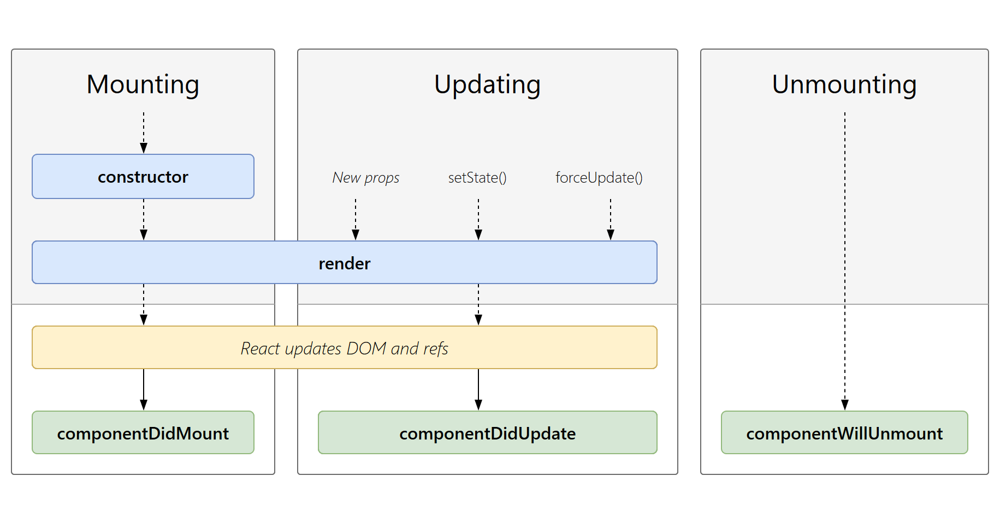
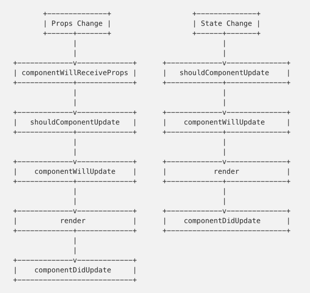
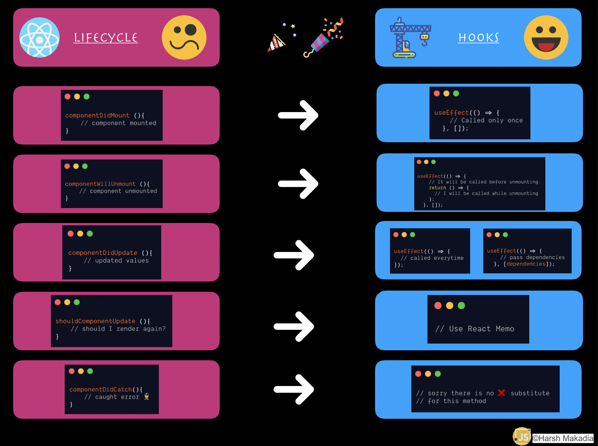
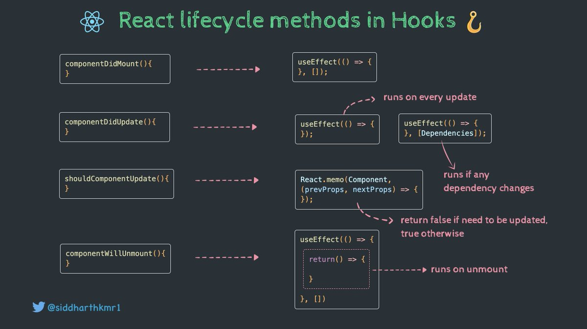

# REACT

Why React?

**React.js** is a *JavaScript library*. It was developed by engineers at **Facebook**.

Here are just a few of the reasons why people choose to program with React:

1. React is **fast**. Apps made in React can handle complex updates and still feel quick and responsive.

2. React is **modular**. Instead of writing large, dense files of code, you can write many smaller, reusable files. React’s modularity can be a beautiful solution to JavaScript’s maintainability problems.

3. React is **scalable**. Large programs that display a lot of changing data are where React performs best.

4. React is **flexible**. You can use React for interesting projects that have nothing to do with making a web app. People are still figuring out React’s potential. There’s room to explore.

5. React is **popular**. While this reason has admittedly little to do with React’s quality, the truth is that understanding React will make you more employable.

# Declatative

React makes it painless to create interactive UIs. Design simple views for each state in your application, and React will efficiently update and render just the right components when your data changes.

Declarative views make your code more predictable and easier to debug.

# Component-Based

Build encapsulated components that manage their own state, then compose them to make complex UIs.

Since component logic is written in JavaScript instead of templates, you can easily pass rich data through your app and keep state out of the DOM.

